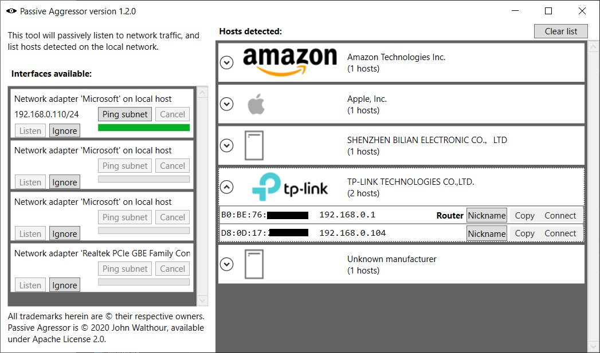

# passiveAgressor
Lists out the hosts that can be determined by passively listening to network traffic.

# Installation
1. Install [WinPcap 4.1.3](https://www.winpcap.org/install/default.htm)
2. If you want to use the FileZilla quick connect button, download and install [FileZilla](https://filezilla-project.org/download.php) at the default location.
3. Download the latest release from [here](https://github.com/jwalthour/passiveAgressor/releases)
4. Unzip into a folder with write permissions for normal users
5. Run `PassiveAggressor.exe`

